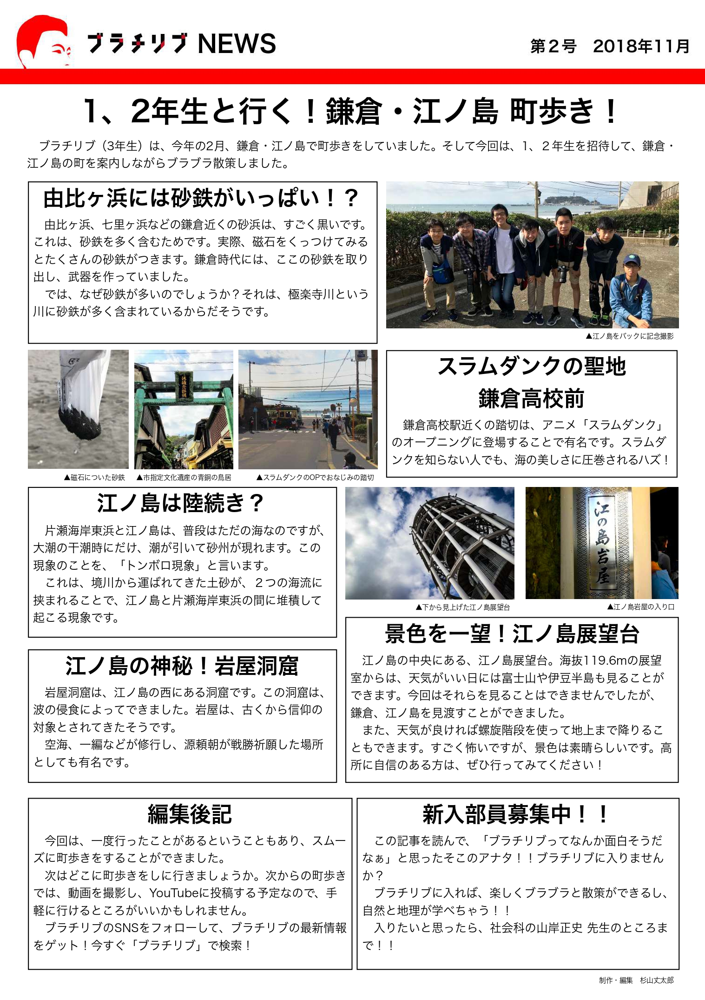
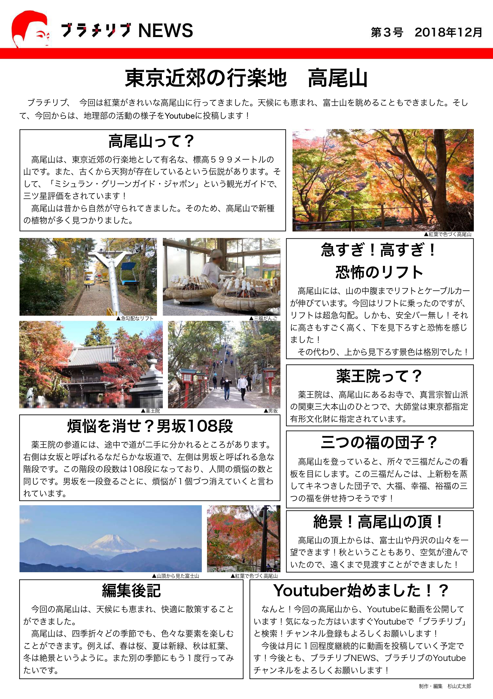
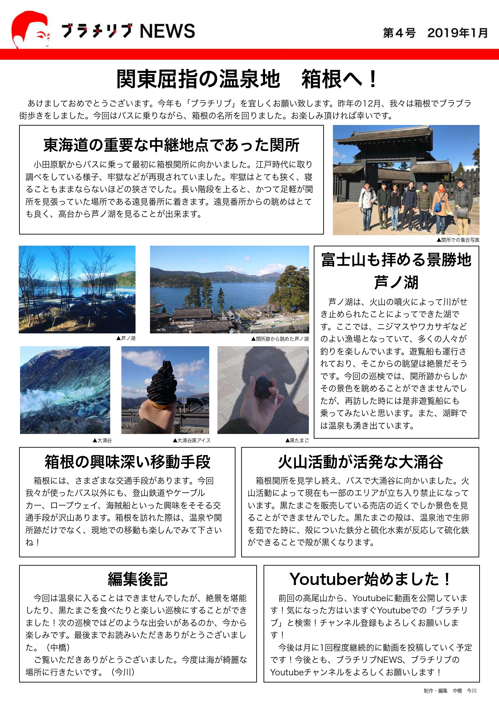
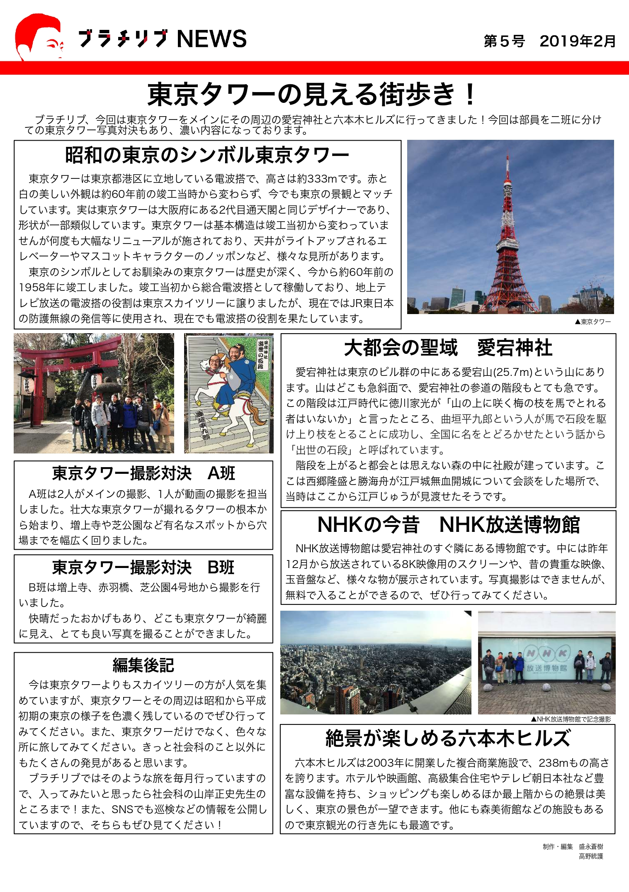
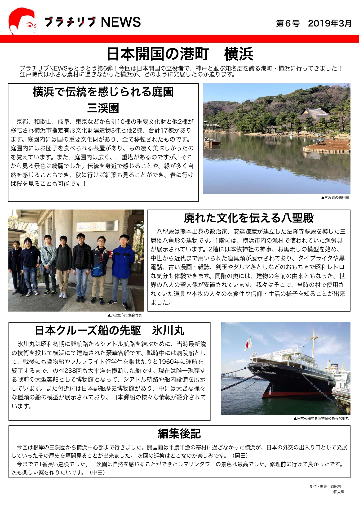
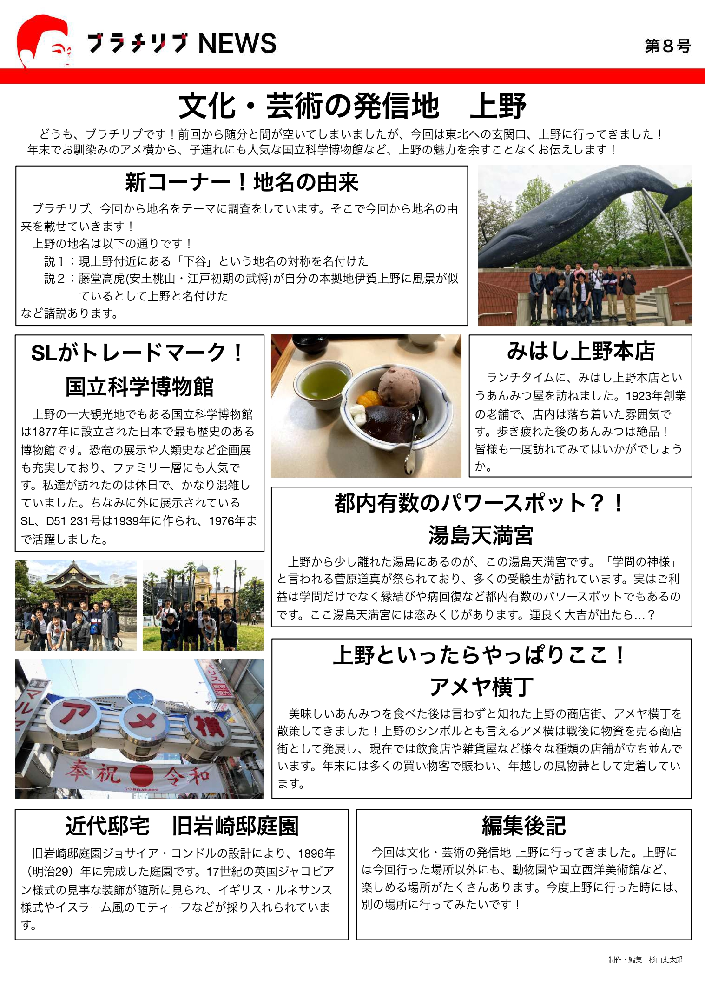
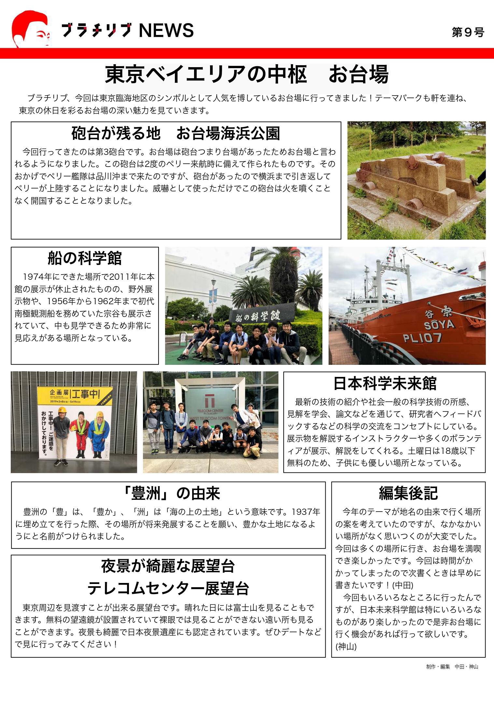
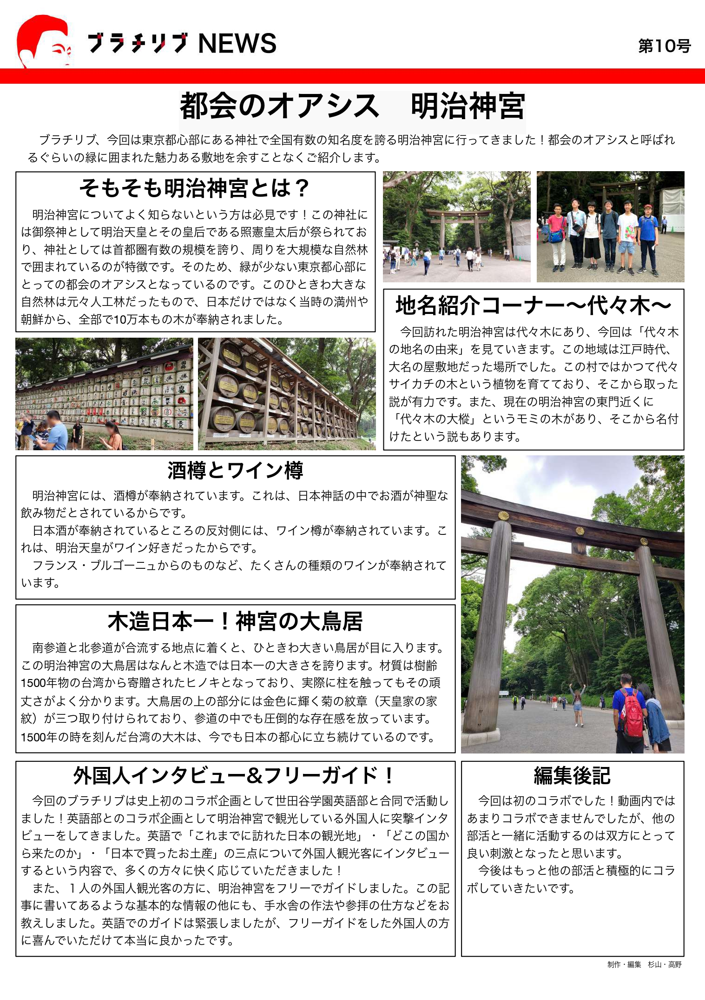
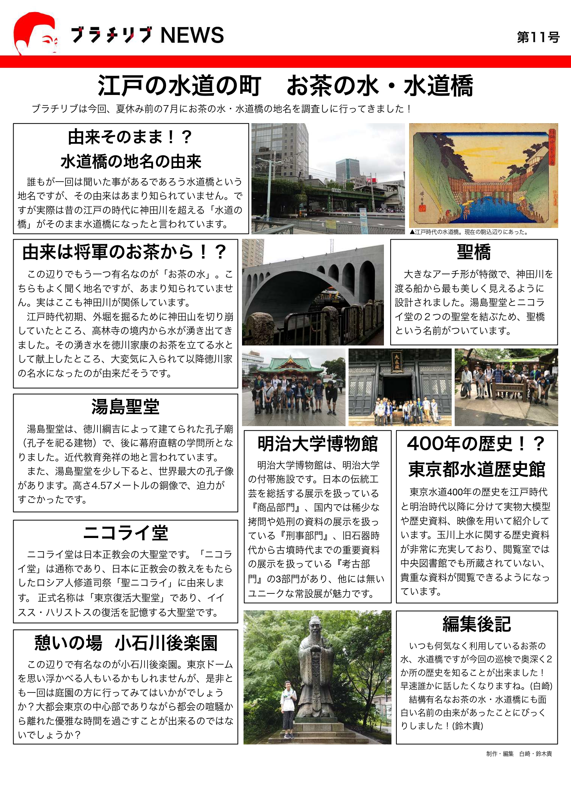

# 部長とクイズバトル
NHK Eテレ「沼にハマってきいてみた」でも紹介された 新感覚ARクイズアプリ！

## スクリーンショット

## 紹介動画

## インストール
[AppStore](https://apps.apple.com/jp/app/id1479295376) からインストールして遊んでみてね！

（iOS 12.1以降のiPhone・iPod touch、iPadOS 12.1以降のiPadで動作）

## ARトラッキング素材
部長とクイズバトルをプレイするには、ARトラッキング素材を端末のカメラで読み取る必要があります！

[Google Drive](https://drive.google.com/drive/folders/1MrIoVWPqcHykcmGArWzKvkz3fV2dVHnU?usp=sharing) か [GitHub](https://github.com/sugijotaro/BurachiribuARQuizApp/blob/master/%E9%83%A8%E9%95%B7%E3%81%A8%E3%82%AF%E3%82%A4%E3%82%BA%E3%83%90%E3%83%88%E3%83%AB%E3%83%88%E3%83%A9%E3%83%83%E3%82%AD%E3%83%B3%E3%82%B0%E7%B4%A0%E6%9D%90.zip) からからARトラッキング素材をダウンロードしてカラーで印刷するか、[このページ](README.md)を別の端末で表示してください！

